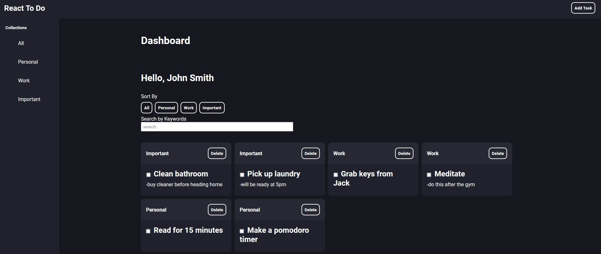

# React To Do Tracker



> A todo tracker with dashboard created with MongoDB, ExpressJS, ReactJS, and NodeJS.

---

### Table of Contents

- [Description](#description)
- [How To Use](#how-to-use)
- [References](#references)
- [Author Info](#author-info)

---

## Description

Creating ReadMe's for your Github repository can be tedious.  I hope this template can save you time and effort as well as provide you with some consistency across your projects.

#### Technologies

- [React](https://reactjs.org/)
- [MongoDB](https://www.mongodb.com/)
- [ExpressJS](https://expressjs.com/)
- [NodeJS](https://nodejs.org/en/)
- [Mongoose](https://mongoosejs.com/)
- [Dotenv](https://www.npmjs.com/package/dotenv)
- [React-Modal](https://reactcommunity.org/react-modal/)
- [Sass](https://sass-lang.com/)

[Back To The Top](#react-to-do-tracker)

---

## How To Use

#### Installation
```html
git clone https://github.com/eko-develops/react-todo.git
cd react-todo/server
npm install
touch .env
cd ..
cd client
npm install
```
The app uses a database so you'll need to create a free account at [MongoDB](https://www.mongodb.com/) to set up a cluster that holds the database. We will also be using [Mongoose](https://mongoosejs.com/) to create, read, and delete records from the MongoDB database. The ``.env`` file will contain any variables that you don't want to push to production.

You will need to create a `.env` file in the server folder. The installation steps cover that if you are following the steps.

In the ``.env`` file, you really only need to add a `MONGODB_SRV` variable. This variable is used to connect the app to your database. You can find the value by clicking on the connect button for the cluster of your choice then clicking on "Connect your application". Copy the connection string into the `MONGODB_SRV` variable, remove the text "myFirstDatabase" and replace it with the name of your cluster.

By default, the server runs on port 8000. You can add a `PORT` variable in the `.env` file and assign it with whatever port you'd like to use. If no `PORT` variable is found, the server will automatically use port 8000.

That's it for setting up the project! Now you can start the server and react app.

To start the server use:
```html
cd react-to-do/server
node server.js
```

To start React use:
```html
cd react-to-do/client
npm start
```
The project will load and you can start playing around with it!

[Back To The Top](#react-to-do-tracker)

---

## References

[Back To The Top](#react-to-do-tracker)

---

## Author Info

- Email - [ekodevelops@gmail.com](mailto:ekodevelops@gmail.com)
- Discord - [@ekoret#8570](https://discord.com)

[Back To The Top](#react-to-do-tracker)
